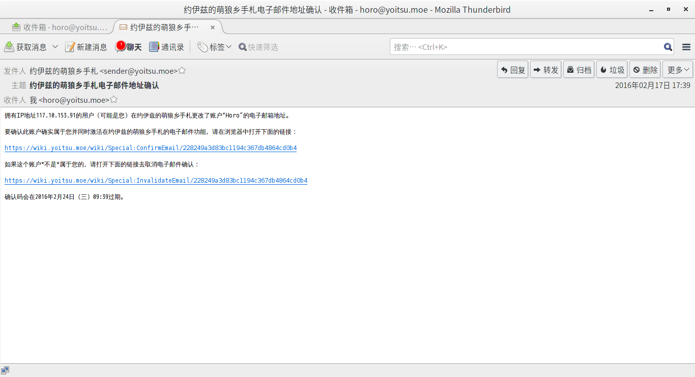

MediaWiki 设置SMTP发送邮件
=========================================

:slug: smtp_for_mediawiki
:lang: zh
:date: 2016-02-18 15:20
:tags: mediawiki,notes
:series: MediaWiki

.. PELICAN_BEGIN_SUMMARY

为 MediaWiki 设置通过 SMTP 发送邮件.就是这样  _(:з」∠)_ 

.. PELICAN_END_SUMMARY

.. contents::

为啥要搞 SMTP 发信?
-----------------------------

* 邮件功能在重置密码和通知时非常重要 (･ω･)

* 听说用 PHP 的 mail() 函数发送的邮件容易被当成垃圾邮件(然而咱压根没收到😂

所以才要搞 SMTP 呗~

安装需要的库
------------------------------

PHP 7 木有 pear 啦 (Arch Linux 官方源在 PHP7 升级后从官方源里移除了 :code:`php-pear` )~,所以通过 composer 安装呗~

首先安装上 composer ,如果汝在用 Arch Linux 的话:

    sudo pacman -S php-composer
    
其它系统的话,可以参照 `Composer 官方的安装指南 <https://getcomposer.org/download/>`_ 进行安装呗~

在安装上 composer 以后安装 mail 和 smtp 包:

    composer require --update-no-dev pear/mail pear/net_smtp
    
如果汝像咱一样安装的是 alpha 版(从 Git 下载的,去掉 :code:`--update-no-dev` 选项.

还在用 PHP 5? 用 pear 安装:

    sudo pear install Mail Net_SMTP

设置 $wgSMTP 和 $wgPasswordSender 变量
-------------------------------------------

`MediaWiki.org 的指南 <https://www.mediawiki.org/wiki/Manual:$wgSMTP>`_

:code:`$wgSMTP` 大概像这样:

.. code-block:: php

    $wgSMTP = array(
        'host'     => "mail.example.com", // SMTP 服务器的地址 (或IP).如果使用了SSL,记得加上 ssl://
        'IDHost'   => "example.com",      // 汝的域名,可选.如果不设置的话会设置成 $wgServer 的值.
        'port'     => 25,                 // 端口(一般是25,SSL是465,StartTLS是587)
        'auth'     => true,               // 是否需要 SMTP 认证 (多半都需要呗~)
        'username' => "my_user_name",     // SMTP 认证的用户名.
        'password' => "my_password"       // SMTP 认证的密码.
    );
    
举个栗子  _(:з」∠)_ :

.. code-block:: php

    $wgSMTP = array(
        'host'     => "smtp.yandex.com", // 咱用的是 Yandex 的 Domain mail~
        'port'     => 587,                 // StartTLS =w=
        'auth'     => true,               // 需要登录 😂
        'username' => "sender@yoitsu.moe",     // 用户名啦~
        'password' => "foo"       // 密码啦~
    );
    
有些时候 SMTP 服务器要求外发邮件地址中的发件人和实际一致 (例如 Yandex ),这时需要设置 :code:`$wgPasswordSender` 变量:

.. code-block:: php

    $wgPasswordSender="sender@yoitsu.moe";
    
修改完以后用某个功能(例如修改邮件地址测试一下呗~):

