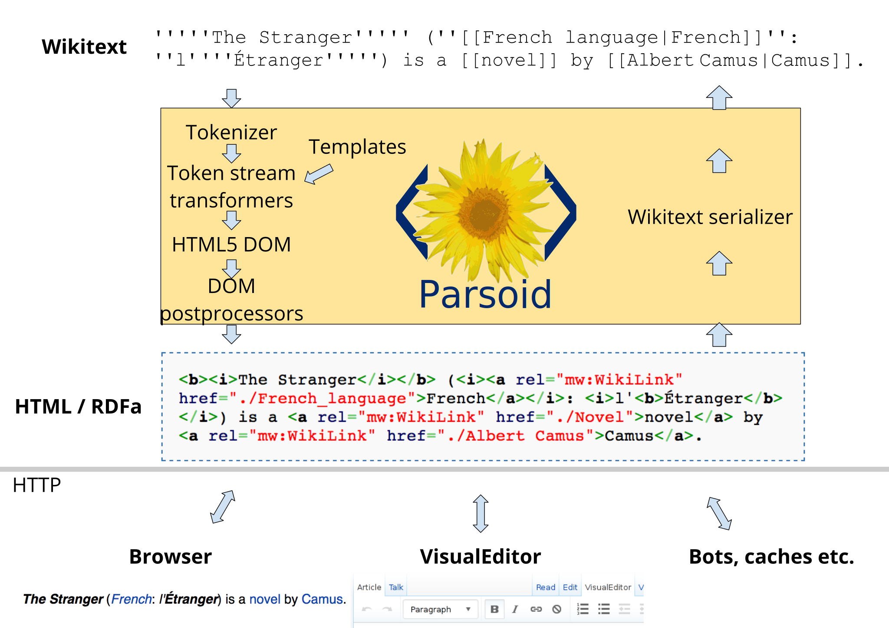
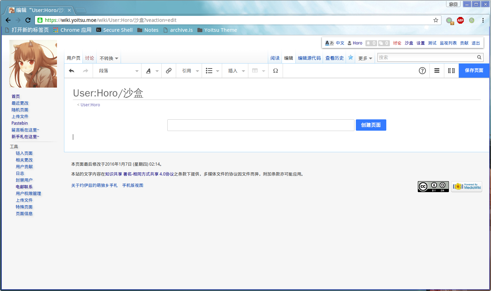

为MediaWiki安装可视化编辑器
=========================================

:slug: visualeditor_for_mediawiki
:lang: zh
:date: 2015-01-17 09:35
:tags: mediawiki,notes
:series: MediaWiki

.. PELICAN_BEGIN_SUMMARY

为MediaWiki安装来自 `维基媒体基金会 <https://www.mediawiki.org/wiki/VisualEditor>`_ 的 `可视化编辑器 <https://www.mediawiki.org/wiki/VisualEditor>`_ .

.. PELICAN_END_SUMMARY

.. contents::

连维基百科都要Hold不住啦~
-----------------------------

    许多新用户不会着手大幅度修改，而只是做些细节调整，不过仅仅阅读源代码就必须学标记语言了。当我们的用户在演示操作时，这把他们吓走了。

    早在 2004 年，社群开始一再认识到必须采用更好的编辑方式。因为人们的请求，更重要的是他们的需要，所以我们开发了可视化编辑器。

    Wiki 标记语言让新人害怕，这种程度会随着其他站点的迁离而加剧。如果我们不开发可视化编辑器，那么图表的走势会在接下来五年中变得更加糟糕。

    -- `MediaWiki.org <https://www.mediawiki.org/wiki/VisualEditor/Portal/Why/zh>`_

所以他们才 :del:`痛定思痛` 决定开发可视化编辑器么😂

开始之前-检查一下要求
------------------------------

可视化编辑器(下面就说VisualEditor呗~)还需要一个叫
`Parsoid <https://www.mediawiki.org/wiki/VisualEditor/Portal/Why/zh>`_
的程序来承担把wiki标记转化成html的任务啦(看下图)~,所以需要服务器来运行它呐~

安装Parsoid(Ubuntu 14+ / Debian 7+ )
--------------------------------------

上游的指南在这(好好学英语呗~) `<https://www.mediawiki.org/wiki/Parsoid/Setup>`_

Ubuntu和Debian系统的话直接添加MediaWiki.org的软件源然后通过apt安装就好了啦~

首先添加MediaWiki.org的GPG公钥:

.. code-block:: bash

    sudo apt-key advanced --keyserver keys.gnupg.net --recv-keys 664C383A3566A3481B942F007A322AC6E84AFDD2

然后添加Parsoid源:

.. code-block:: bash

    sudo echo "deb https://releases.wikimedia.org/debian jessie-mediawiki main" > /etc/apt/sources.list.d/parsoid.list

安装需要的软件包:

.. code-block:: bash

    sudo apt-get update && sudo apt-get install curl parsoid

然后看下下面一节的内容修改一下配置文件呗~

其它系统?手动安装呗~
---------------------------------

上游的指南在这(还是要好好学英语呗~) `<https://www.mediawiki.org/wiki/Parsoid/Developer_Setup>`_

首先汝要装上Nodejs(>0.8,建议0.10或更新的版本呐~),还有git.
具体的安装方法为了避免降低正交性 :del:`(其实是系统太多不好写......)`,就麻烦汝自己去找了呐~

    「呵。咱是贤狼，不是神呐。如果汝开始会期待起咱能够泄露天机给汝，那咱就得从汝眼前消失了呗。」

.. code-block:: bash

    node --version # 如果是Debian或Ubuntu ,输入 nodejs --version

然后用git克隆版本库呗~

.. code-block:: bash

    git clone https://gerrit.wikimedia.org/r/p/mediawiki/services/parsoid

用npm安装上相应的依赖:

.. code-block:: bash

    npm install

然后看下面一节的内容修改一下配置文件呗~

修改配置文件
------------------------------

    如果是通过软件源安装的,配置文件位于 :code:`/etc/mediawiki/parsoid/settings.js`

    如果是通过git下载的,从parsoid目录中先复制一份样例出来呗~

    .. code-block:: bash

        cp localsettings.js.example localsettings.js

打开配置文件,找到这一段内容,然后改它~:

.. code-block:: javascript

    parsoidConfig.setMwApi({
        // The "prefix" is the name given to this wiki configuration in the
        // (deprecated) Parsoid v1 API.
        prefix: 'localhost', // optional
        // The "domain" is used for communication with Visual Editor
        // and RESTBase.  It defaults to the hostname portion of
        // the `uri` property below, but you can manually set it
        // to an arbitrary string.
        domain: 'localhost', // optional
        // This is the only required parameter:
        // the URL of you MediaWiki API endpoint.
        uri: 'http://localhost/w/api.php'
        });

其中"uri"对应汝的wiki的api.php的位置,"domain"是汝的域名啦~."prefix"可以自己起一个(反正因为换了API也没用啦~,不过测试时可能用得到)

启动服务
-------------------------

-------------------------
从软件源安装的?
-------------------------

.. code-block:: bash

    sudo systemctl start parsoid # Debian Jessie ,用Systemd启动

    sudo service parsoid start # Debian Wheezy 或Ubuntu ,用init.d脚本启动.

如果汝不是通过远程访问执行的命令,可以在浏览器上打开 :code:`http://localhost:8142` 来进行测试.试着加载 :code:`http://localhost:8142/汝设置的前缀/汝的wiki上的一个页面` 试试呗~

-------------------------
用git安装的?
-------------------------

.. code-block:: bash

    npm start

或者:

.. code-block:: bash

    node bin/server.js

可以用screen一类的工具让Parsoid在后台运行~

如果汝不是通过远程访问执行的命令,可以在浏览器上打开 :code:`http://localhost:8000` 来进行测试.试着加载 :code:`http://localhost:8000/汝设置的前缀/汝的wiki上的一个页面` 试试呗~

------------------------------------
修改监听地址便于远程测试
------------------------------------

改这一段:

.. code-block:: javascript

    // Allow override of port/interface:
    //parsoidConfig.serverPort = 8142;
    //parsoidConfig.serverInterface = '127.0.0.1';

反注释最后一行并改成0.0.0.0,就可以通过 :code:`http://服务器的IP地址:8142` 访问啦~

安装VisualEditor扩展
--------------------------------------

上游的指南在这: `<https://www.mediawiki.org/wiki/Extension:VisualEditor>`_

首先从 `这里 <https://www.mediawiki.org/wiki/Special:ExtensionDistributor/VisualEditor>`_ 获得扩展然后上传到汝的wiki上的extensions目录呗~

然后修改汝的LocalSettings.php:

.. code-block:: php
    $wgVirtualRestConfig['modules']['parsoid'] = array(
    // URL to the Parsoid instance
    // Use port 8142 if you use the Debian package
    // Parsoid 运行的位置,如果是从软件源安装的,默认设置是'http://localhost:8142'
    'url' => 'http://localhost:8000',
    // Parsoid "domain", see below (optional)
    // 汝在Parsoid中设置的"domain"值呐~
    'domain' => 'localhost',
    // Parsoid "prefix", see below (optional)
    // 汝在Parsoid中设置的"prefix"值呐~
    'prefix' => 'localhost'
    );

    require_once "$IP/extensions/VisualEditor/VisualEditor.php";

    // 反注释下一行来默认启用可视化编辑器
    #$wgDefaultUserOptions['visualeditor-enable'] = 1;

    // 反注释下一行来启用测试中的功能
    #$wgDefaultUserOptions['visualeditor-enable-experimental'] = 1;

    //在除了主名字空间以外的名字空间中也启用可视化编辑器(下面的例子是用户名字空间)
    $wgVisualEditorNamespaces=array_merge($wgContentNamespaces,array( NS_USER ));

完整的设置选项可以在扩展页面上找到.

然后在汝的wiki上试试看呗~

